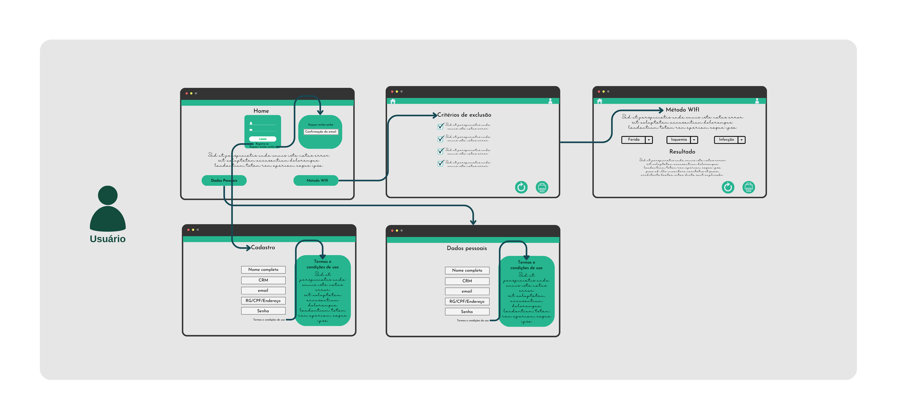
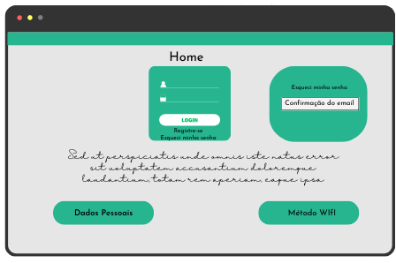
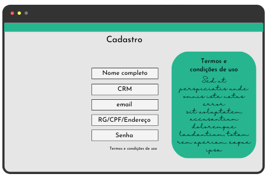
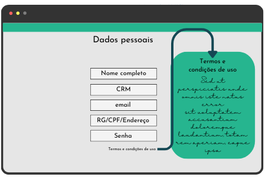
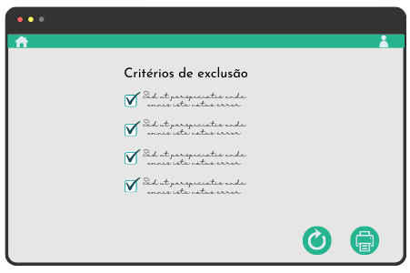
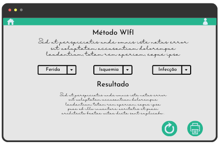

# Projeto de Interface

A tela de avaliação do método WIfI foi projetada de forma a exibir todas as questões e opções de resposta de forma clara e organizada. Além disso, a interface permite que o médico responda cada pergunta individualmente, garantindo que nenhum critério seja deixado de lado. A plataforma conta com uma tela de cadastro do médico. Nessa interface, o médico pode preencher informações como nome, CRM, especialidade, email e senha.

Para agilizar o resultado do sistema WIfI, a plataforma foi projetada para ser responsiva e compatível com os principais navegadores do mercado, como Google Chrome, Firefox e Microsoft Edge. Isso permite que o médico acesse a plataforma de qualquer dispositivo, incluindo smartphones e tablets, e receba o resultado da avaliação do paciente rapidamente.

Em resumo, a plataforma foi elaborada de forma a atender aos requisitos funcionais, não funcionais e histórias de usuário abordados, proporcionando uma interface amigável, segura e eficiente para avaliação de pacientes utilizando o método WIfI.

## User Flow

O Fluxo de usuário foi elaborado levando em consideração o acesso simplificado a ferramenta para que o profissional da saúde possa tomar a decisão da maneira mais rápida possível, respeitando a LGPD e o sigílo médico.

## Wireframes

Essa proposta de layout prioriza o usuário que já possui um cadastro, permitindo que acesse o método WIfI com um clique

Cadastro para novos usuários com verificador de validade do CRM e apresentação do termo de uso

Permite alteração de dados cadastrais e revisão do termo de uso

O método WIfI possui critérios de exlusão da aplicação, dessa maneira pretendemos garantir que o profissional de saúde verifique se é o caso de aplicar o método

Proposta de layout direta de aplicação das 3 etapas, cada uma representada em um campo de texto em cascata, após a seleção das 3 caixas o resultado é apresentado em baixo. Lembrando que são dois outputs possíveis, o Risco de Amputação e o Benefício de Revascularização.

