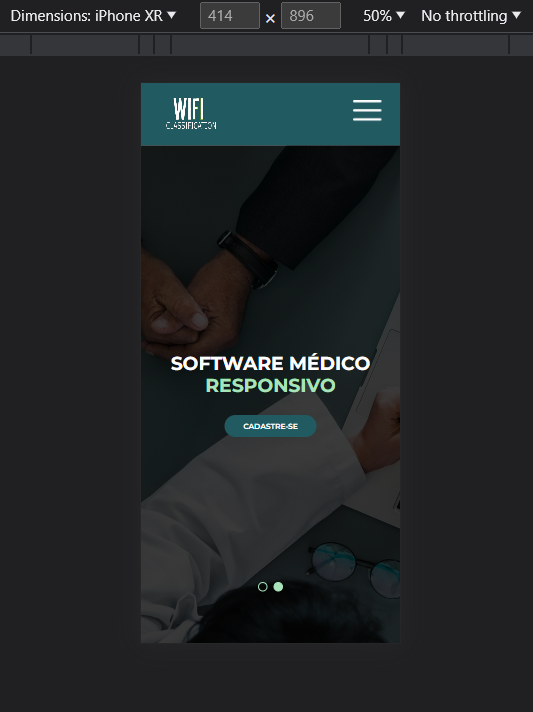

# Template padrão do site

Layout padrão do site (HTML e CSS) que será utilizado em todas as páginas com a definição de identidade visual, aspectos de responsividade e iconografia:

**Os seguintes screenshots comprovam a responsividade do site para os diversos dispositivos encontrados no mercado.**:

 > IPad mini:

 
 
 > IPhone XR:

 > 

> Nest Hub Max:

> 
