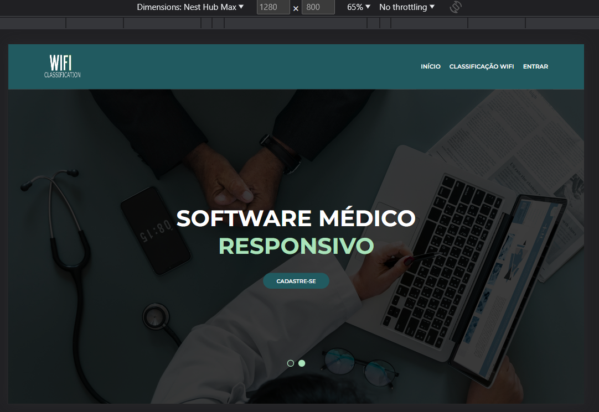

# Template padrão do site

A tela inicial foi construída no template padrão, com a adição de uma imagem de fundo, conforme o seguinte screenshot.

Layout padrão do site (HTML e CSS) que será utilizado em todas as páginas com a definição de identidade visual, aspectos de responsividade e iconografia.

**Os seguintes screenshots comprovam a responsividade do site para os diversos dispositivos encontrados no mercado.**:
 > IPad mini:
 
 
 > IPhone XR:
 > 

> Nest Hub Max:
> 
