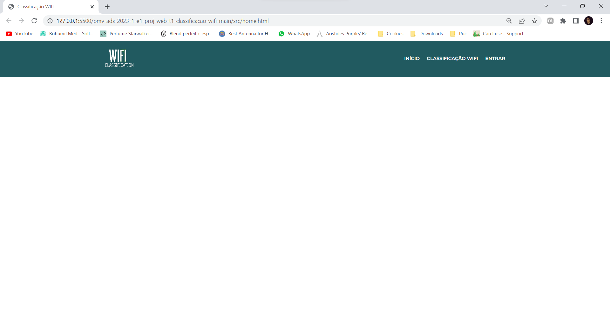

# Template padrão do site:

O padrão de layout a ser utilizado pelo site tem correspondência ao projeto de Interface elaborado anteriormente, conforme a imagem a seguir:

O template criado está disponível no site http://github.com/ e é composto pelos seguintes layouts:

- `Index`: Página inicial onde hospedamos informações sobre o método WIFi, bem como sobre o produto que oferecemos nessa aplicação.
- `Classificação WIFI`: Onde hospedamos a calculadora do método WIFi.
- `Entrar`: Onde hospedamos a ferramenta de Login da aplicação.

**Responsividade:
A responsividade foi feita por media queries configuradas de acordo com os principais dispositivos presentes no mercado.**

