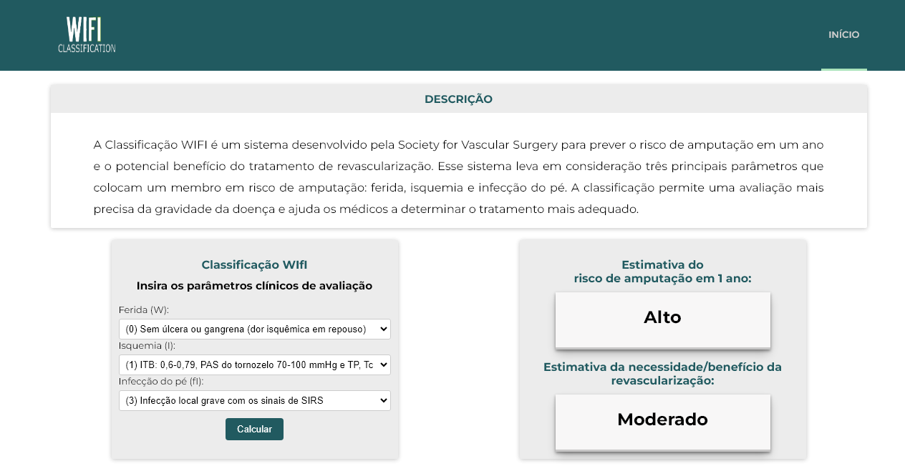

# Funcionalidades do Sitemas (Telas)

Nesta seção serão apresentadas as telas desenvolvidas para cada uma das funcionalidades do sistema. O respectivo endereço (URL) e outras orientações de acesso serão apresnetadas na sequência.

## Cadastro do médico (RF-001)

O sistema possui um link para cadastro do usuário médico.

### Requisitos atendidos
- RF-001: A aplicação deve possuir um cadastro do médico.

## Calculadora: classificação WIfI (RF-002, RF-003 e RF-004)

A aplicação possui uma calculadora para gerar o resultado do risco de amputação em 1 ano e do benefício/necessidade de revascularização a partir do método WIfI. Os dados de entrada são inseridos uma única vez em um campo que identifica cada um dos critérios avaliados. Os resultados são exibidos em outro campo que identifica cada resultado exibido.

### Requisitos atendidos
  - RF-002: A aplicação deve exibir cada questão avaliada pelo método wifi com as opções de resposta pré-definidas em uma caixa de respostas anexa à questão.
  - RF-003: A aplicação deve calcular ambos os resultados a partir de uma única entrada de dados.
  - RF-004: A aplicação deve exibir ambos os resultados do método wifi (risco de amputação e estimativa de benefício de revascularização) em dois campos distintos com uma legenda que os identifique, em negrito e fonte maior que os outros textos.

